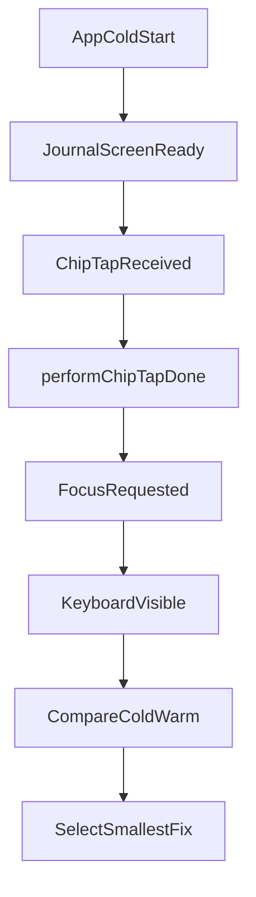

# Architecture

## Inputs Reviewed

- [GraceNotes/docs/agent-log/initiatives/issue-51-first-launch-chip-keyboard/brief.md](./brief.md)
- [GraceNotes/docs/agent-log/SCHEMA.md](../../SCHEMA.md)
- [.agents/skills/architect/SKILL.md](../../../../../.agents/skills/architect/SKILL.md)
- [GraceNotes/GraceNotes/Features/Journal/Views/JournalScreen.swift](../../../GraceNotes/Features/Journal/Views/JournalScreen.swift)
- [GraceNotes/GraceNotes/Features/Journal/Views/JournalScreenChipHandling.swift](../../../GraceNotes/Features/Journal/Views/JournalScreenChipHandling.swift)
- [GraceNotes/GraceNotes/Features/Journal/ViewModels/JournalViewModel.swift](../../../GraceNotes/Features/Journal/ViewModels/JournalViewModel.swift)
- [GraceNotes/GraceNotes/Application/PerformanceTrace.swift](../../../GraceNotes/Application/PerformanceTrace.swift)

## Decision

Treat `#51` as an instrumentation-first responsiveness initiative scoped to the first-launch chip-tap edit path. Ship in two slices: first, measure and make tap recognition immediately visible; second, apply the smallest mitigation at the measured bottleneck until cold-path tap-to-keyboard behavior reaches target responsiveness.

## Goals

- Make first-launch chip tap feel immediately acknowledged, even before the keyboard is visible.
- Reduce cold-path tap-to-keyboard latency to a practical target (`< 1.0s` goal on representative local runs).
- Identify where time is spent (tap handler, focus request, keyboard show, or overlapping persistence work) before applying mitigation.
- Preserve existing input-pipeline reliability from `#36`/`#37` while improving first-launch responsiveness.

## Non-Goals

- Do not expand into general warm-session keyboard tuning.
- Do not revisit startup freeze handling from `#31` or settings/reminder work from `#33`.
- Do not redesign Journal UI structure beyond a lightweight acknowledgement state needed to avoid perceived unresponsiveness.
- Do not perform broad persistence refactors unless instrumentation shows they are a direct blocker in this path.

## Technical Scope

### Slice 1: Diagnose and guardrail UX

1. Add timing checkpoints around:
   - chip tap event received
   - `JournalScreenChipHandling.performChipTap(...)` completion
   - `restoreInputFocus(...)` focus request
   - keyboard-visible notification (`keyboardWillShow` or `keyboardDidShow`)
2. Tag traces so first-launch cold runs can be compared with warm runs.
3. Add immediate in-UI acknowledgement that chip tap is accepted (for example, temporary editing highlight/state) so 4-5 second silence is removed even before root-cause mitigation lands.
4. Capture whether first-save/autosave work overlaps the first chip tap path and contributes to main-thread pressure.

### Slice 2: Targeted remediation

1. Use Slice 1 traces to select one primary bottleneck and fix only that path first.
2. Candidate mitigation areas (ordered by likely containment):
   - focus restoration timing and sequencing in `JournalScreen`
   - keyboard lifecycle orchestration around first focus request
   - deferring non-critical synchronous work that overlaps first chip tap
3. Keep mitigation narrow and reversible; avoid speculative multi-system changes.

## Affected Areas

- `JournalScreen.chipTapped(...)` and `restoreInputFocus(...)`
- `JournalScreenChipHandling.performChipTap(...)`
- `JournalViewModel.persistChanges()` and autosave path (correlation checks only unless proven bottleneck)
- `PerformanceTrace` labels for first-launch chip edit milestones

## Instrumentation Flow

## Latency Targets and Measurement Gates

- **Primary SLO:** `chipTap -> keyboardVisible < 1000 ms` on first-launch path.
- **Checkpoint budget targets:**
  - `chipTap -> performChipTapDone < 100 ms`
  - `performChipTapDone -> FocusRequested < 50 ms`
  - `FocusRequested -> keyboardVisible < 850 ms`
- **Pass gate:** 5 consecutive cold-path repro runs all under `1000 ms`, with no run over `1200 ms`.
- **Warm guardrail:** no measurable regression in warm-path responsiveness versus current baseline.

## Risks and Edge Cases

- iOS keyboard cold-load may dominate; app-level mitigation may be bounded.
- Focus timing fixes can accidentally regress input stability if they conflict with prior hardening from `#36`/`#37`.
- Added instrumentation and UI acknowledgement must not create extra async races in section switching.
- Different chip sections (gratitude/need/person) may not behave identically on first access and must be validated separately.

## Sequencing

1. Add and validate cold-path instrumentation events and log labels.
2. Add immediate tap acknowledgement state that is visible without waiting for keyboard appearance.
3. Gather cold vs warm timing samples and identify dominant delay segment.
4. Implement one focused remediation at that segment.
5. Re-run first-launch and warm-path verification; expand mitigation only if close criteria fail.

## Close Criteria

- First-launch chip tap no longer appears ignored; immediate acknowledgement is visible.
- Cold-path timing data shows `chipTap -> keyboardVisible` meeting target envelope.
- Timing data identifies the reduced bottleneck (not only subjective UX improvement).
- No regressions in chip tap/edit/add/submit flows across gratitude, need, and person sections.
- No recurrence of keyboard disappearance or input loss behavior covered by `#36`/`#37`.

## Open Questions

- Should release packaging be a patch (`0.3.x`) or bundled into a broader milestone? (product sequencing decision; not a technical blocker)

## Next Owner

`Builder`, then `Test Lead`.

Implementation handoff expectations:

- Add the scoped instrumentation and immediate acknowledgement state first.
- Provide before/after timing evidence for first-launch and warm runs.
- Keep remediation isolated to measured bottleneck areas only.

Testing handoff expectations:

- Validate first-launch path and warm path separately.
- Validate all three chip sections (`gratitudes`, `needs`, `people`) with same repro steps.
- Confirm no regressions in add-chip, submit, and quick section-switch interactions.
